<html>
    <body>
    项目结构
        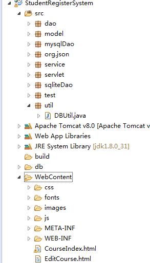 
    数据库结构
        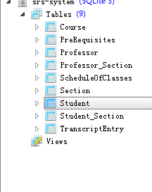 
    类图
    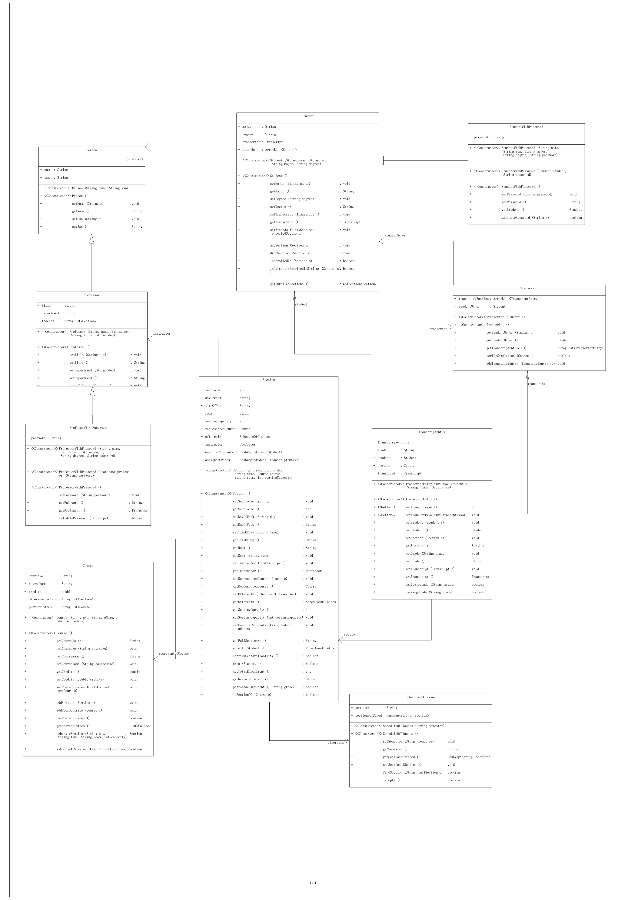 
    添加课程
     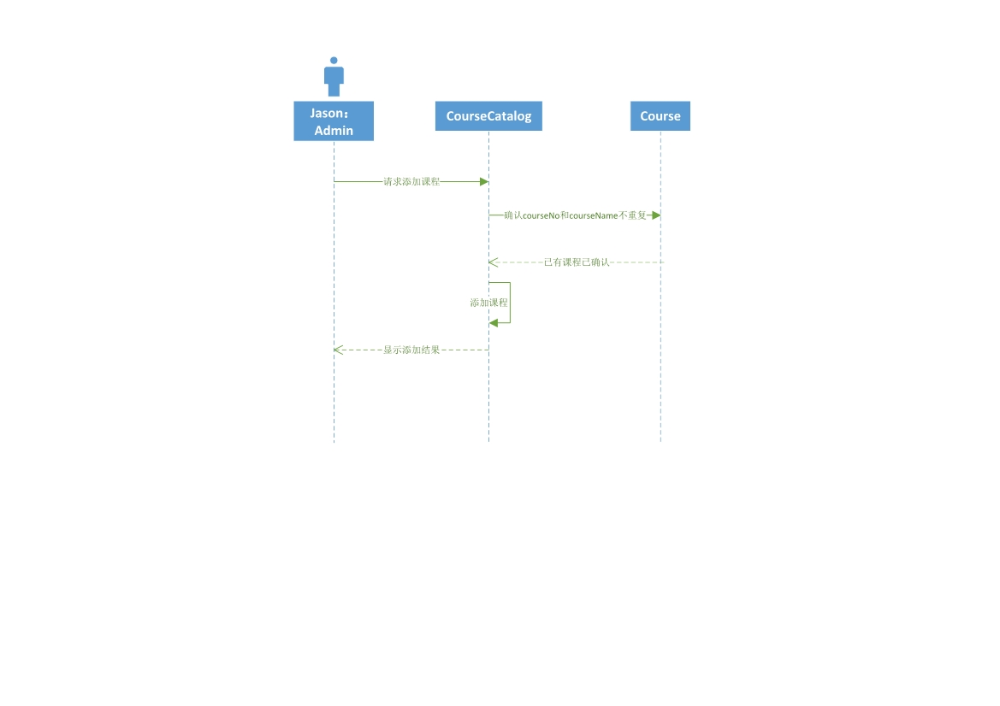 
    选课
      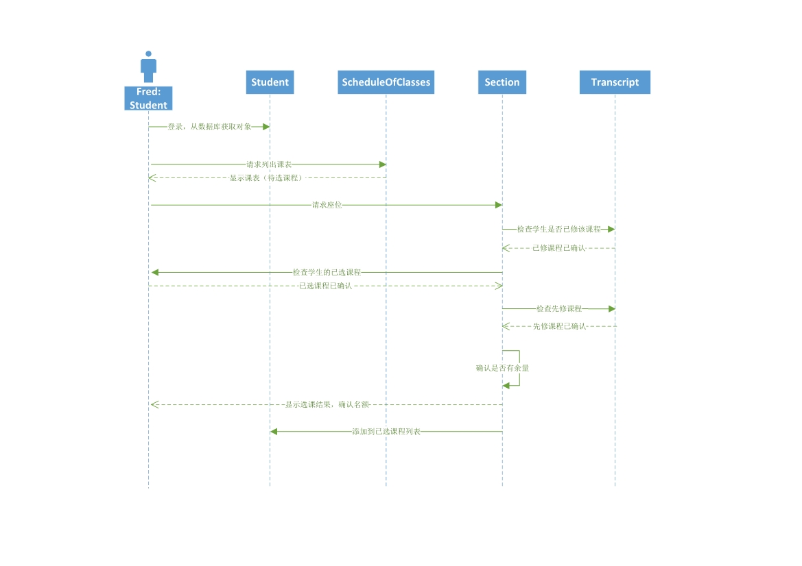 
    登录
     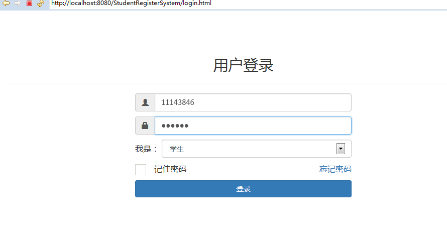 
    课程管理
     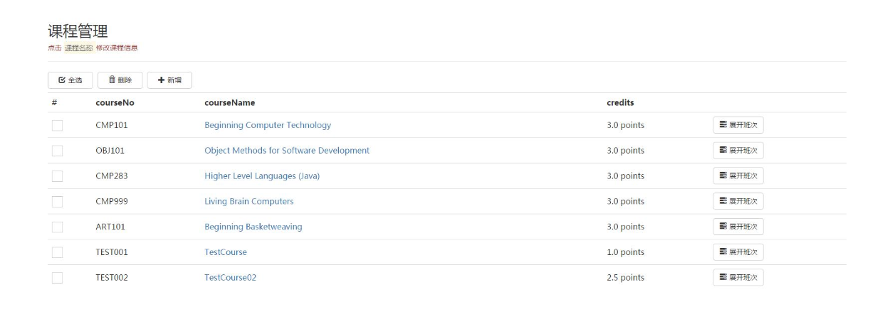 
    添加课程
     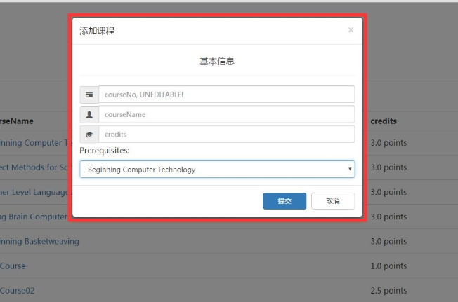 
    修改课程信息
     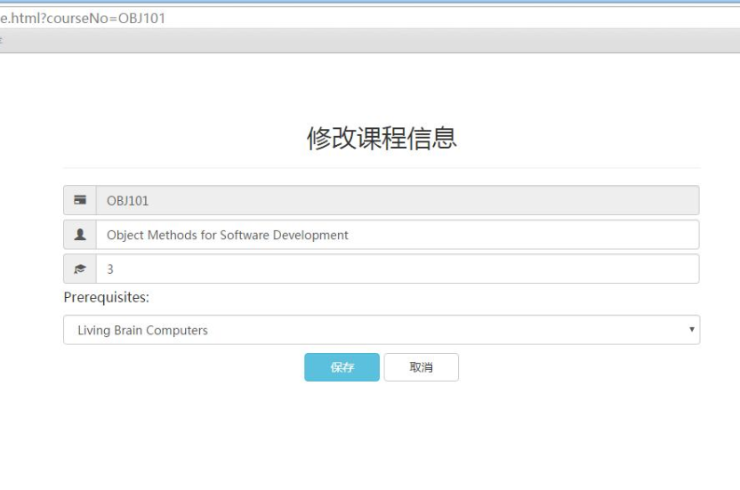 
    教师管理
     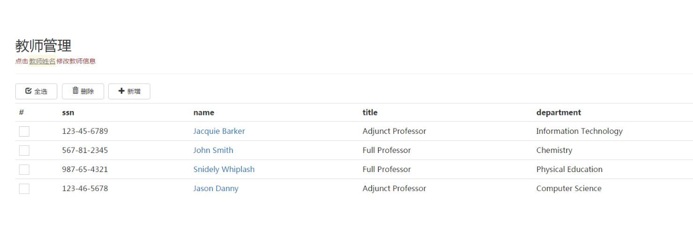 
    修改教师信息
     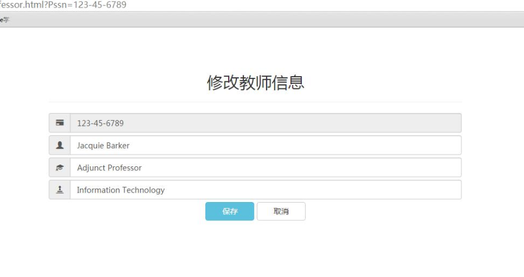 
     选课
      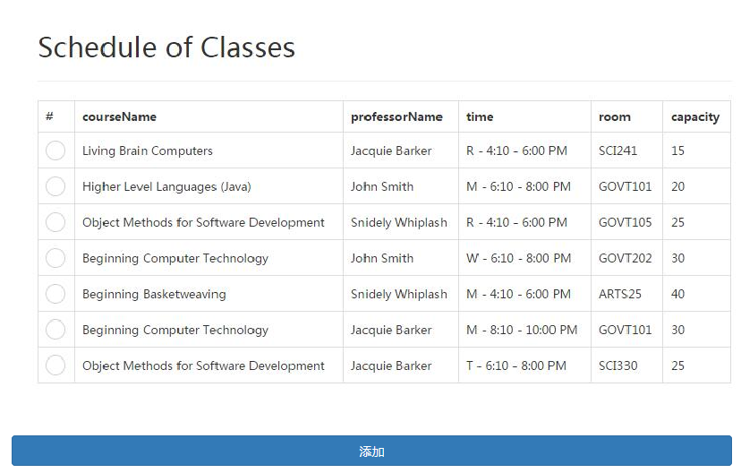 
 </body>
</html>
